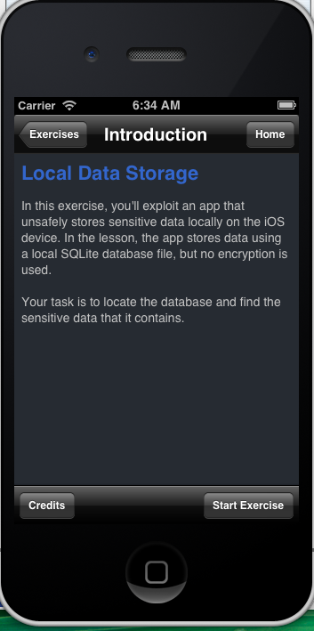

# M2：安全でないデータストレージ

<table>
 <tr>
  <th>脅威エージェント</th>
  <th>攻撃経路</th>
  <th colspan="2">セキュリティ上の弱点</th>
  <th>技術的な影響</th>
  <th>ビジネスへの影響</th>
 </tr>
 <tr>
  <td align="center" width="20%">アプリケーション依存 </td>
  <td align="center" width="15%">攻撃難易度 容易</td>
  <td align="center" width="15%">普及度 中</td>
  <td align="center" width="15%">検出難易度 普通</td>
  <td align="center" width="17.5%">影響度 重大</td>
  <td align="center" width="17.5%">アプリケーション / ビジネス依存</td>
 </tr>
 <tr>
  <td>脅威エージェントには以下が含まれます。 
   紛失/盗難されたモバイルデバイスを手に入れた攻撃者。モバイルデバイス上で、攻撃者の意図した動作を行なうマルウェアや変更を加えられたアプリケーション。</td>
  <td>攻撃者が物理的にモバイルデバイスを手に入れると、攻撃者はフリーのソフトウェアを利用してモバイルデバイスをコンピュータに接続します。これらのツールによって、攻撃者は、しばしば個人識別情報(PII)やその他の機密情報資産が含まれる全てのサードパーティアプリケーションディレクトリ内を閲覧することが可能になります。攻撃者は、それらの情報資産を盗むためのマルウェアを作成したり正規のアプリケーションを改ざんしたりします。</td>
  <td colspan="2">安全でないデータストレージの脆弱性は、ユーザやマルウェアがモバイルデバイスのファイルシステムやデバイス上のデータストア内の機密情報にアクセスしないだろうと、開発チームが想定する場合に発生します。しかし、ファイルシステムは簡単にアクセスすることが出来ます。そのため組織は、悪意のあるユーザやマルウェアが機密データストアを調べるということを想定しておくべきです。また、脆弱な暗号ライブラリの使用は避けるべきです。なぜなら、モバイルデバイスをルート化もしくはJailbreakすることによって、あらゆる暗号化を回避出来るからです。データが適切に保護されていない場合、専用のツールさえあれば、アプリケーションデータを閲覧することができます。</td>
  <td>少なくとも、1ユーザのデータ損失、場合によっては多数のユーザのデータが損失する可能性があります。また、以下の技術的な影響が発生する可能性があります。 
   モバイルマルウェア、改ざんされたアプリ、またはフォレンジックツールの使用によるアプリの機密情報の抽出。 
   ビジネスへの影響は、窃取された情報の性質に依存します。安全でないデータは以下のビジネスへの影響につながる可能性があります。
   <ul>
    <li> なりすまし犯罪</li>
    <li> プライバシーの侵害</li>
    <li> 詐欺</li>
    <li> 風評被害</li>
    <li> 外部のポリシーへの違反(PCI)</li>
    <li> 物的損失</li>
   </ul>
  </td>
  <td>安全でないデータストレージの脆弱性は、リスクがあるアプリケーションを所有する組織にとって、主に以下のビジネスリスクをもたらします。
   <ul>
    <li> なりすまし犯罪</li>
    <li> 詐欺</li>
    <li> 風評被害</li>
    <li> 外部のポリシー違反(PCI)</li>
    <li> 物的損失</li>
   </ul>
  </td>
 </tr>
</table>

## 脆弱性有無の確認
本カテゴリには、「安全でないデータデータストレージ」と「意図しないデータ漏えい」が含まれます。
安全に保存されていないデータには、以下が含まれますが、これらに限定されません。
 - SQLデータベース
 - ログファイル
 - XMLデータストアもしくはマニフェストファイル
 - バイナリデータストア
 - Cookieストア
 - SDカード
 - 同期されたクラウド

意図しないデータ漏えいには、以下における脆弱性が含まれますが、これらに限定されません。
 - OS
 - フレームワーク
 - コンパイラ環境
 - 新しいハードウェア

本カテゴリの脆弱性が発生するのは、明らかに開発者の認識不足が原因です。それは、モバイル開発では特にドキュメント化されていない、もしくは十分にドキュメント化されていない以下のような内部プロセスに見られます。
 - OSがデータ、イメージ、キー入力、ロギング、バッファをキャッシュするプロセス
 - 開発フレームワークがデータ、イメージ、キー入力、ロギング、バッファをキャッシュするプロセス
 - 広告、解析、ソーシャル、イネーブルメントフレームワークがデータ、イメージ、キー入力、ロギング、バッファをキャッシュするプロセスやデータの総量

## 防止方法
アプリケーションが処理する情報資産やAPIがそれら資産をどのように利用するかを理解するために、モバイルアプリケーション、OS、プラットフォーム、フレームワークの脅威モデルを作成することが重要です。それらが以下の種類の機能をどのように利用するか理解することが必要不可欠です。
 - URLキャッシュ(リクエストとレスポンス両方)
 - キーボード入力キャッシュ
 - コピー/ペーストバッファキャッシュ
 - アプリケーションバックグラウンド
 - 中間データ
 - ロギング
 - HTML5データストレージ
 - ブラウザのCookieオブジェクト
 - サードパーティに送信される解析データ

## 攻撃シナリオの例
### 視覚的な例
iGoatは、セキュリティ対策を行なうコミュニティが直接このような種類の脆弱性を体験できるように、脆弱性を意図的に有するモバイルアプリケーションです。以下のエクササイズで示すように、偽の銀行アプリに認証情報を入力しログイン後、ファイルシステムに移動します。そしてアプリケーションディレクトリ内に、「credentials.sqlite」というデータベースを見つけることができます。このデータベースを調査することによって、アプリケーションがユーザ名と認証情報(Jason:pleasedontstoremebro!)を平文で保存していることが分かります。

 
 
 

## 参考資料
### OWASP
 - [OWASP IOS Developer Cheat Sheet](https://www.owasp.org/index.php/IOS_Developer_Cheat_Sheet)

### 外部リンク
 - [Google Androids Developer Security Topics 1 ](http://source.android.com/tech/security/)
 - [Google Androids Developer Security Topics 2 ](http://developer.android.com/training/articles/security-tips.html)
 - [Apple's Introduction to Secure Coding](https://developer.apple.com/library/mac/)
 - [Fortify On Demand Blog - Exploring The OWASP Mobile Top 10: Insecure Data Storage](http://h30499.www3.hp.com/t5/Application-Security-Fortify-on/Exploring-The-OWASP-Mobile-Top-10-M1-Insecure-Data-Storage/ba-p/5904609)
