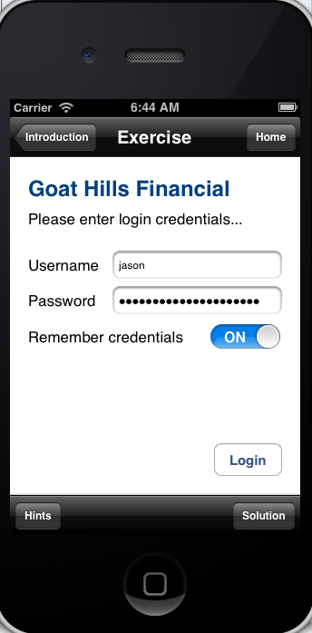

# M2：安全でないデータ保存

<table>
 <tr>
  <th>脅威エージェント</th>
  <th>攻撃経路</th>
  <th colspan="2">セキュリティ上の弱点</th>
  <th>技術的な影響</th>
  <th>ビジネスへの影響</th>
 </tr>
 <tr>
  <td>アプリケーション依存 </td>
  <td>攻撃難易度：容易</td>
  <td>普及度：中</td>
  <td>検出難易度：普通</td>
  <td>深刻な影響</td>
  <td>アプリケーション / ビジネス依存</td>
 </tr>
 <tr>
  <td>脅威エージェントには以下が含まれます。 
   紛失/盗難されたモバイルデバイスを手に入れた攻撃者。モバイルデバイス上で、攻撃者のために動作するマルウェアや再パッケージされたアプリ。</td>
  <td>攻撃者が物理的にモバイルデバイスを手に入れると、攻撃者は自由に入手できるソフトウェアを利用します。そしてモバイルデバイスをコンピュータに接続します。これらのツールによって、攻撃者は、個人識別情報(PII)や他の機密情報資産がしばしば含まれるサードパーティアプリケーションディレクトリ内を閲覧することが可能になります。攻撃者は、情報資産を盗むためのマルウェアを作成したり正規のアプリを改ざんしたりします。</td>
  <td colspan="2">安全でないデータ保存の脆弱性は、モバイルデバイスのファイルシステムやデバイス上のデータストア内の機密情報にユーザやマルウェアがアクセスしないだろうと、開発チームが想定する場合に発生します。ファイルシステムは簡単にアクセス可能です。組織は、悪意のあるユーザやマルウェアが機密データストアを調べるということを想定しておくべきです。脆弱な暗号ライブラリの使用は避けるべきです。モバイルデバイスをルート化もしくはJailbreakすることによって、あらゆる暗号保護を回避します。データが適切に保護されていなければ、専用のツールさえあれば、アプリケーションデータを閲覧することができます。</td>
  <td>最良のケースでは、1ユーザのデータ損失、最悪のケースだと多数のユーザのデータ損失につながる可能性があります。また、以下の技術的な影響につながる可能性があります。 
   モバイルマルウェア、改ざんされたアプリ、またはフォレンジックツールの使用によるアプリの機密情報の抽出。 
   ビジネスへの影響は、窃取された情報の性質に依存します。安全でないデータは以下のビジネスへの影響につながる可能性があります。
   <ul>
    <li> なりすまし犯罪</li>
    <li> プライバシー侵害</li>
    <li> 詐欺</li>
    <li> 風評被害</li>
    <li> 外部のポリシー違反(PCI)</li>
    <li> 物的損失</li>
   </ul>
  </td>
  <td>安全でないデータ保存の脆弱性は、リスクがあるアプリを所有する組織にとって、以下のビジネスリスクをもたらします。
   <ul>
    <li> なりすまし犯罪</li>
    <li> 詐欺</li>
    <li> 風評被害</li>
    <li> 外部のポリシー違反(PCI)</li>
    <li> 物的損失</li>
   </ul>
  </td>
 </tr>
</table>

## 脆弱性有無の確認
本カテゴリには、「安全でないデータ保存」と「意図しないデータ漏えい」が含まれます。
安全に保存されていないデータは、以下が含まれますが、これらに限定されません。
 - SQLデータベース
 - ログファイル
 - XMLデータストアもしくはマニフェストファイル
 - バイナリデータストア
 - Cookieストア
 - SDカード
 - 同期されたクラウド

意図しないデータ漏えいには、以下における脆弱性が含まれますが、これらに限定されません。
 - OS
 - フレームワーク
 - コンパイラ環境
 - 新しいハードウェア

これらは、明らかに開発者が認識していないことが原因です。これらは、モバイル開発では特にドキュメント化されていない、もしくは十分にドキュメント化されていない以下のような内部プロセスに見られます。
 - OSがデータ、イメージ、キー入力、ロギング、バッファをキャッシュする方法
 - 開発フレームワークがデータ、イメージ、キー入力、ロギング、バッファをキャッシュする方法
 - データ広告、解析、ソーシャル、イネーブルメントフレームワークがデータ、イメージ、キー入力、ロギング、バッファをキャッシュする方法や総量

## 防止方法
アプリが処理する情報資産やこれらの資産をAPIがどのように処理するかを理解するために、モバイルアプリ、OS、プラットフォーム、フレームワークの脅威モデルを作成することが重要です。それらが以下の種類の機能をどのように処理するか理解することが非常に重要です。
 - URLキャッシュ(リクエストとレスポンス両方)
 - キーボード入力キャッシュ
 - コピー/ペーストバッファキャッシュ
 - アプリケーションバックグラウンド
 - 中間データ
 - ロギング
 - HTML5データ保存
 - ブラウザのCookieオブジェクト
 - サードパーティに送信される解析データ

## 攻撃シナリオの例
### 視覚的な例
iGoatは、セキュリティコミュニティが直接このような種類の脆弱性を調査できるように意図的に脆弱にしたモバイルアプリです。以下のエクササイズでは、偽の銀行アプリに認証情報を入力しログインします。その次に、ファイルシステムに進みます。アプリケーションディレクトリ内に、「credentials.sqlite」というデータベースを見つけることができます。このデータベースを調査することによって、アプリケーションがユーザ名と認証情報(Jason:pleasedontstoremebro!)を平文で保存していることが分かります。

 
 
 

## 参考資料
### OWASP
 - [OWASP IOS Developer Cheat Sheet](https://www.owasp.org/index.php/IOS_Developer_Cheat_Sheet)

### その他
 - [Google Androids Developer Security Topics 1 ](http://source.android.com/tech/security/)
 - [Google Androids Developer Security Topics 2 ](http://developer.android.com/training/articles/security-tips.html)
 - [Apple's Introduction to Secure Coding](https://developer.apple.com/library/mac/)
 - [Fortify On Demand Blog - Exploring The OWASP Mobile Top 10: Insecure Data Storage](http://h30499.www3.hp.com/t5/Application-Security-Fortify-on/Exploring-The-OWASP-Mobile-Top-10-M1-Insecure-Data-Storage/ba-p/5904609)
